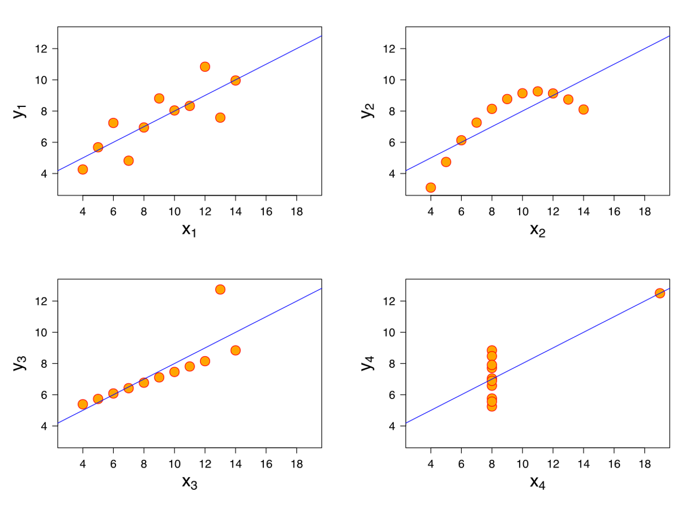
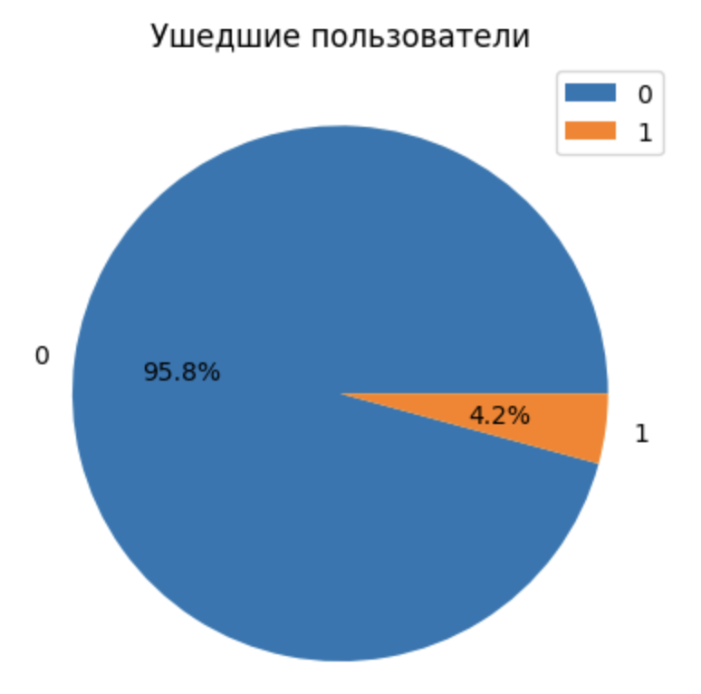
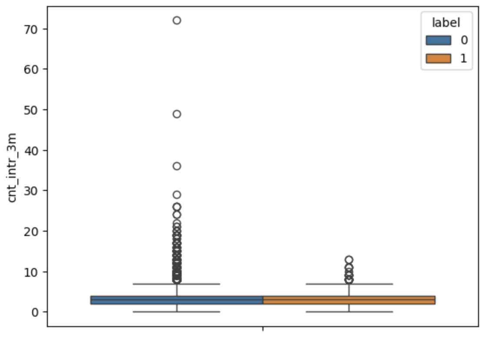
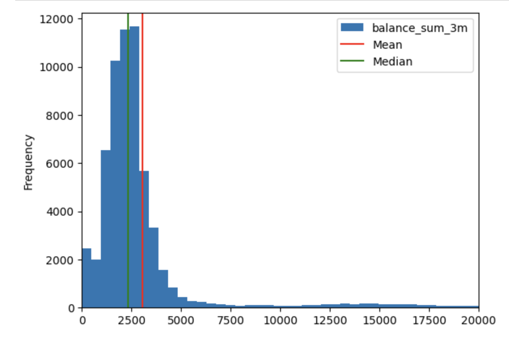

# День 01 — Дескриптивный и разведочный анализ
## Проект по дескриптивному и разведочному анализу
В рамках этого проекта ты начнешь лучше понимать данные за счет расчета простых базовых статистик и построения графиков.

## Оглавление

1. [Глава I](#глава-i) \
    1.1. [Преамбула](#преамбула)
2. [Глава II](#глава-ii) \
    2.1. [Общая инструкция](#общая-инструкция)
3. [Глава III](#глава-iii) \
    3.1. [Цели](#цели)
4. [Глава IV](#глава-iv) \
    4.1. [Задание](#задание)
5. [Глава V](#глава-v) \
    5.1. [Сдача работы и проверка](#сдача-работы-и-проверка)

## Глава I
### Преамбула

До сих пор мы довольно много говорили о качестве данных и уделили этому значительную часть времени, но не менее важным является этап «понимания» данных. Не обладая достаточным пониманием данных, не чувствуя их, сложно проводить предиктивный анализ. Порой это скорее похоже на блуждание в темноте и дергание разных рычагов и ручек. И наоборот, обладая достаточным пониманием данных, ты сможешь лучше интерпретировать то, что тебе будет выдавать модель машинного обучения, лучше принимать решения о том, где и что в ней стоит поменять. 

Дескриптивный и разведочный анализ данных по сути состоит из расчета простых статистик и построения графиков. Уже на этом этапе мы можем получить ценные для бизнеса инсайты. Либо можем выявить неточности и нестыковки в данных и сделать еще один шаг к улучшению качества датасета — и в целом процесса управления качеством данных в организации.

Хотим отдельно отметить пользу именно визуализации данных, потому что порой дескриптивные статистики в отдельности могут приводить нас к неверным выводам. Например, ниже ты можешь увидеть набор статистик:

<table>
  <tr>
   <td><strong>Статистика</strong>
   </td>
   <td><strong>Значение</strong>
   </td>
  </tr>
  <tr>
   <td>Среднее x
   </td>
   <td>9
   </td>
  </tr>
  <tr>
   <td>Дисперсия x
   </td>
   <td>11
   </td>
  </tr>
  <tr>
   <td>Среднее y
   </td>
   <td>7.50
   </td>
  </tr>
  <tr>
   <td>Дисперсия y
   </td>
   <td>4.125
   </td>
  </tr>
  <tr>
   <td>Корреляция между x и y
   </td>
   <td>0.816
   </td>
  </tr>
  <tr>
   <td>Линейная регрессия
   </td>
   <td>y = 3.00 + 0.5x
   </td>
  </tr>
  <tr>
   <td>Коэффициент детерминации
   </td>
   <td>0.67
   </td>
  </tr>
</table>

Если попытаться представить на одном графике x и y, то в голове рисуется вытянутое облако точек, ось которого проходит где-то по диагонали графика. И кажется, что это единственный вариант представить расположение точек, согласующееся с этими характеристиками.

Но это не так, и существует несколько способов, как может выглядеть расположение.

Это так называемый квартет Энскомба.

Поэтому вывод следующий. Если тебе говорят только среднюю, этого недостаточно. Нужно понимать, а какая вариация у признака. Возможно, среднее ни о чем не говорит. Если тебе говорят о высоком коэффициенте корреляции, то этого тоже недостаточно — нужно посмотреть на расположение точек. Возможно, там есть экстремальные значения или значений очень мало. Если говорят о низком коэффициенте корреляции, то этого также недостаточно — возможно, зависимость есть, просто она нелинейная. И это снова сможет продемонстрировать график.

Сегодня ты этим и займешься.

Расписание проектов

**День 00. Сбор данных:** \
Данные находятся в разрозненных источниках. Их надо собрать и объединить в единый датасет и разобраться какие данные у нас есть.

**День 01. Анализ данных ← Ты находишься здесь:** \
Работа с простыми дескриптивными статистиками. Цель — чуть лучше понять анализ данных, выявить дополнительные проблемы с качеством данных и решить их. Ты построишь гистограммы, разные графики, чтобы еще лучше понять, как устроены данные. Всё это может дать идеи для создания новых продуктов.

**День 02. Машинное обучение:** \
Займемся задачей предсказания оттока клиентов. Подготовим данные к обучению.
Обучим несколько моделей машинного обучения. Оценим качество предсказания.

**День 03. Глубокое обучение:** \
Познакомимся с несколькими моделями глубокого обучения. 

**День 04. Внедрение:** \
Используя искусственный интеллект, ты разработаешь идею улучшения существующего процесса в твоей сфере. Ты оценишь финансовый эффект от модели, трудозатраты, необходимые ресурсы, какой точности нужно добиться и с кем из стейкхолдеров следует переговорить.

## Глава II
### Общая инструкция

Методология «Школы 21» может быть не похожа на тот образовательный опыт, который с тобой случался ранее. Ее отличает высокий уровень автономии: у тебя есть задача, и ты должен ее выполнить. По большей части тебе нужно будет самому добывать знания для ее решения. Второй важный момент — это peer-to-peer обучение. В образовательном процессе нет преподавателей и экспертов, перед которыми ты защищаешь свой результат. Ты это делаешь перед такими же учащимися, как и ты сам. У них есть чек-лист, который поможет им выполнить приемку твоей работы качественно.

Роль «Школы 21» заключается в том, чтобы обеспечить через последовательность заданий и оптимальный уровень поддержки такую траекторию обучения, при которой ты освоишь не только hard skills, но и научишься самообучаться.

* Не доверяй слухам и предположениям о том, как должно быть оформлено твое решение. Этот документ является единственным источником, к которому стоит обращаться по большинству вопросов.
* Твое решение будет оцениваться другими учащимися.
* Подлежат оцениванию только те файлы, которые ты сдал на проверку.
* Cдавай на проверку только те файлы, что были указаны в задании.
* Не забывай, что у тебя есть доступ к Интернету и поисковым системам.
* Обсуждение заданий можно вести и в мессенджерах.
* Будь внимателен к примерам, указанным в этом документе: они могут иметь важные детали, которые не были оговорены другим способом.
* И да пребудет с тобой Сила!

## Глава III
### Цели

Расчет дескриптивных статистик — само по себе занятие несложное. К тому же, с точки зрения работы в Google Colab, ты неплохо поднаторел в предыдущем проекте, и многие команды тебе уже знакомы. Да, придется кое-что самостоятельно поискать в Интернете, но кого это испугает после предыдущего проекта?

## Глава IV
### Задание
Сегодня тебе предстоит работать с датасетом dataset_01_06.csv, который собирал вчера по кусочкам и с таким же датасетом dataset_07_12.csv на вторую половину года. Они находятся в папке [src/datasets](https://disk.yandex.ru/d/vYR4GahXvKAwiA). Тебе нужно будет рассчитывать разные дескриптивные статистики и строить графики.

Напомним, что ты продолжаешь работать в Google Colab. MS Excel по-прежнему под запретом. Ноутбук этого проекта ты сможешь найти здесь: `src/day-01-assignment.ipynb`, как и другие файлы к этому проекту, ты сможешь найти по [ссылке](https://disk.yandex.ru/d/Mra33ApfTE2L8g). В нем снова есть список команд, которые могут быть тебе полезны для реализации этого задания. Но на этот раз их меньше, чем обычно.

Итак, что тебе нужно будет сделать:

## Задание 1
Объедини датасеты `dataset_01_06` и `dataset_07_12` в один под названием `dataset`. \
Выведи размеры получившегося датасета.

## Задание 2
Пока у нас нет задачи изучить наших клиентов «в динамике», мы просто хотим описать нашего клиента. 

Давай создадим переменную `dataset_unique`. В нее сохраним **последние** данные об **уникальных** клиентах. В этом тебе поможет метод [drop_duplicates](https://pandas.pydata.org/pandas-docs/stable/reference/api/pandas.DataFrame.drop_duplicates.html) и его параметр `keep`.

Выведи количество строк получившегося датасета. Для того чтобы убедиться, что ты все выполнил верно, выполни код `assert len(dataset_unique) == 60699`. Он должен выполниться без ошибок.

## Задание 3
Построй круговую диаграмму pie-plot по количеству ушедших клиентов. За отток клиента отвечает признак `label`. 

Для того чтобы красиво дополнить график, добавь эти аргументы `autopct='%1.1f%%', legend=True, title='Ушедшие пользователи', ylabel=''` в метод `pie()`. Чтобы узнать больше о pie-plot, [нажми сюда](https://pandas.pydata.org/docs/reference/api/pandas.DataFrame.plot.pie.html).
Какой процент пользователей отказался от наших услуг?

Ожидаемый результат (*изображение может отличаться по стилю):

## Задание 4
Первая гипотеза, которую все хотят проверить — если клиент часто обращается в поддержку, то ему что-то не нравится, и, возможно, он собирается отказаться от наших услуг (хотя на самом деле, часто все наоборот).

C помощью функции sns.boxplot построй график «ящик с усами» по количеству обращений клиента **за 3 месяца** по ушедшим и оставшимся клиентам. В этом тебе поможет аргумент `hue`.
Чтобы узнать больше о функции sns.boxplot, [нажми сюда](https://seaborn.pydata.org/generated/seaborn.boxplot.html).

Отличается ли медиана количества обращений у ушедших и оставшихся клиентов?

Ожидаемый результат:

## Задание 5
У нас имеются данные баланса клиента. Данные баланса клиента **за 3 месяца** собраны в колонке `balance_sum_3m`. Интересно посмотреть, сколько в среднем клиенты держат на счетах.

C помощью функции диаграммы hist-plot построй гистограмму баланса пользователей. Для функции `hist` используй аргумент `bins=200`. Чтобы узнать больше о функции hist-plot, [нажми сюда](https://pandas.pydata.org/docs/reference/api/pandas.DataFrame.plot.hist.html).

Также рассчитай среднее и медиану для колонки `balance_sum_3m`. Сохрани их в переменные `mean` и `median`. С помощью функции `plt.axvline` добавь эти статистики на гистограмму.

Ожидаемый результат:

## Задание 6
Надеемся, что за предыдущие задания у тебя уже появились гипотезы, которые ты бы хотел визуализировать.

Используя инструменты, с которыми ты познакомился ранее, визуализируй статистики, интересные уже лично тебе. Чем больше, тем лучше. :)

## Задание 7
Используя библиотеку [Plotly и функции Density Heatmap](https://plotly.com/python/mapbox-density-heatmaps/), отрисуй тепловую карту клиентов. За маркер возьми **время жизни клиента**.

## Глава V
### Сдача работы и проверка

1. Сохрани решения в файле day-01-assignment.ipynb. Затем скачай его из Google Colab. Для этого нажми на кнопку «Файлы» на панели меню --> «Загрузить как» --> Формат .ipynb.
2. Загрузи файл в любое облачное хранилище (например, Яндекс Диск или Google Диск) и предоставь общий доступ читателя по ссылке. Затем скопируй ссылку.
3. Cоздай документ формата docx или pdf и вставь в него ссылку на свое решение.
4. Прикрепи документ в раздел «Решение» на платформе.

